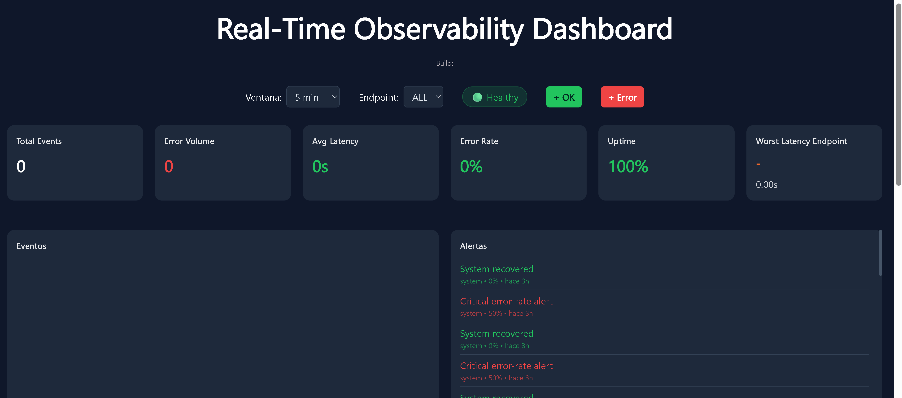

# 🚀 Log Pipeline — Plataforma de Observabilidad en Tiempo Real


Pipeline completo de ingestión, procesamiento, monitorización y visualización de logs en tiempo real, inspirado en conceptos utilizados en plataformas como Datadog, ELK y herramientas modernas de observabilidad.



---

## 📌 Descripción

Este proyecto simula una plataforma de observabilidad end-to-end capaz de:

- Ingerir eventos vía API REST
- Procesar logs en tiempo real con Redis Pub/Sub
- Agregar métricas por ventanas temporales
- Detectar anomalías automáticamente
- Generar alertas y eventos de recuperación
- Visualizar salud del sistema mediante dashboard interactivo
- Consumir eventos en vivo vía WebSocket

Más que una API CRUD, el objetivo fue construir un proyecto orientado a ingeniería backend y pensamiento sistémico.

---

# 🧠 Arquitectura

```text
Cliente
  ↓
FastAPI (/logs)
  ↓
Redis Pub/Sub
  ↓
+---------------------+
|                     |
↓                     ↓
Log Worker        Alert Worker
|                     |
↓                     ↓
PostgreSQL        Alertas
  ↓
FastAPI (/metrics + websocket)
  ↓
Dashboard React en tiempo real
```

---

# ⚙️ Stack Tecnológico

## Backend

- FastAPI
- Python
- SQLAlchemy
- PostgreSQL
- Redis
- Alembic

## Frontend

- React
- Recharts
- WebSockets

## Infraestructura

- Docker / Docker Compose
- Render
- GitHub

---

# 📊 Funcionalidades

## Dashboard de Observabilidad

Incluye monitorización en tiempo real de:

- Total de eventos
- Volumen de errores
- Latencia media
- Error rate
- Disponibilidad (uptime)
- Estado del sistema (Healthy / Warning / Critical)
- Endpoints más lentos
- Evolución temporal de errores y latencia
- Umbral SLO e indicadores de incidente

---

## Agregación de Métricas

Los logs se procesan y agregan por minuto para generar:

- Request volume
- Error counts
- Error rate
- Latencias ponderadas
- Ranking de rendimiento por endpoint

Filtros soportados:

- Ventanas temporales
- Endpoint específico

---

## Sistema de Alertas

Worker dedicado para detección automática de anomalías:

- Alertas por error rate crítico
- Eventos de recuperación automática
- Cooldown para evitar alertas duplicadas

---

## Streaming en Vivo

Actualización vía WebSocket de:

- Nuevos eventos
- Alertas activas
- Recovery events

Sin refresco de página.

---

# 🔄 Flujo de Datos

1. Cliente envía un log a `/logs`
2. Redis publica el evento
3. Worker consume y agrega métricas
4. Alert worker evalúa umbrales
5. PostgreSQL persiste métricas
6. Frontend consulta `/metrics`
7. WebSocket transmite eventos en vivo

---

# 🧪 Generación de Tráfico de Prueba

El repositorio incluye simulador para probar el pipeline completo en local:

```bash
python scripts/demo_generate_logs.py
```

Permite simular:

- Tráfico normal
- Errores 4xx / 5xx
- Picos de latencia
- Escenarios para disparar alertas
- Datos para poblar el dashboard

Útil para validar comportamiento end-to-end del sistema.

---

# ▶️ Ejecución Local

## Backend

```bash
uvicorn main:app --reload
```

## Frontend

```bash
cd frontend
npm install
npm run dev
```

## Docker (opcional)

```bash
docker compose up --build
```

---

# 🌐 Demo

### Frontend

https://log-pipeline-viff.onrender.com

### API

https://logs-api-ull9.onrender.com

---

# 🛠 Qué demuestra este proyecto

Este proyecto pone foco en:

- Arquitectura orientada a eventos
- Procesamiento con workers en background
- Observabilidad y monitorización
- Integración API + WebSockets
- Diseño backend más allá de CRUD
- Patrones de fiabilidad e incident response

---

# 🎯 Objetivo del Proyecto

Quería construir algo más cercano a ingeniería backend real que un proyecto típico de APIs.

El foco fue trabajar conceptos como:

- Streaming de datos
- Métricas operacionales
- Alerting
- Señales de fiabilidad
- Visualización en tiempo real

En esencia, una versión simplificada de una plataforma de observabilidad.

---

# 🔭 Mejoras Futuras

Posibles iteraciones futuras:

- Exportación estilo Prometheus
- Integración OpenTelemetry
- Kafka en lugar de Redis Pub/Sub
- Dashboards multi-tenant
- Integración Grafana
- Despliegue en Kubernetes

---

## Highlights

- Real-time log ingestion pipeline
- Redis Pub/Sub event streaming
- Automated anomaly detection
- SLO latency visualization
- WebSocket live observability dashboard

---

## Estado del proyecto

Proyecto completado como portfolio de observabilidad.
Nuevas mejoras futuras se orientarán únicamente a evolución técnica.

---

## Autor

Marcial Godes

