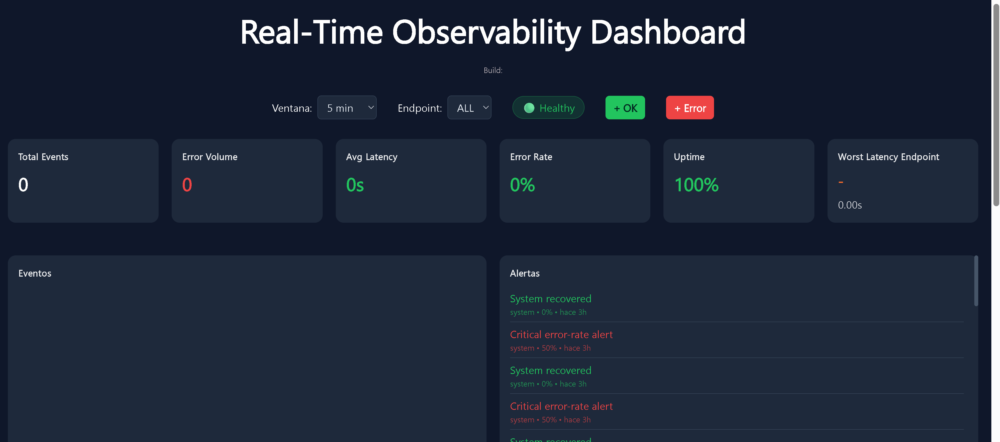

# ⚡ Event-Driven Notification Service


<<<<<<< HEAD

=======
Backend orientado a eventos para gestionar notificaciones asíncronas con procesamiento en background usando colas y workers.
>>>>>>> 8a15842 (Stabilize local demo generator and fix worker startup)

Inspirado en patrones habituales de sistemas distribuidos.

---

## Highlights

- Async notification processing
- Redis-backed task queue
- Celery background workers
- Persisted state transitions
- Event-driven backend design

---

## 📌 Descripción

Este proyecto simula un servicio de notificaciones capaz de:

- Recibir solicitudes vía API REST
- Persistir eventos de notificación
- Encolar tareas en Redis
- Procesar trabajos asíncronos con Celery
- Mantener trazabilidad mediante estados persistidos

Más que una API CRUD, el foco fue construir un servicio pequeño pero representativo de patrones backend reales.

---

## 🧠 Arquitectura

```text
Cliente
  ↓
FastAPI API
  ↓
PostgreSQL (queued)
  ↓
Redis Broker
  ↓
Celery Worker
  ↓
processing → sent / failed
```

---

## ⚙️ Stack Tecnológico

### Backend

- Python
- FastAPI
- SQLAlchemy
- PostgreSQL

### Event Processing

- Redis
- Celery

### Infraestructura

- Docker Compose
- Pytest

---

## 📊 Funcionalidades

### Gestión de estados

Cada notificación recorre este ciclo de vida:

```text
queued
processing
sent
failed
```

Esto permite:

- Trazabilidad
- Auditoría
- Reintentos futuros
- Estado observable del sistema

---

### Procesamiento asíncrono

Flujo:

1. La API persiste la notificación
2. Se encola una tarea en Redis
3. Celery consume la cola
4. Worker actualiza estado a processing
5. Simula el envío
6. Marca sent o failed

Patrón clásico productor → broker → consumidor.

---

## API Endpoints

```http
GET  /health
POST /notifications
GET  /notifications/{notification_id}
```

### Crear notificación

Payload:

```json
{
  "user_id": "42",
  "channel": "email",
  "payload": {
    "message": "hello"
  }
}
```

Response:

```json
{
  "id": "uuid",
  "status": "queued"
}
```

---

## 🧪 Tests

Incluye tests para:

- Health endpoint
- Create notification
- Get notification

Ejecutar:

```bash
pytest -v
```

---

## ▶️ Ejecución Local

Clonar:

```bash
git clone https://github.com/Marcial-Godes/event-driven-notification-service.git
cd event-driven-notification-service
```

Crear entorno virtual:

```bash
python -m venv .venv
```

Windows:

```bash
.venv\Scripts\activate
```

Instalar dependencias:

```bash
pip install -r requirements.txt
```

---

## Variables de entorno

Crear `.env` desde el ejemplo.

Windows:

```bash
copy .env.example .env
```

Linux / Mac:

```bash
cp .env.example .env
```

---

## Infraestructura

```bash
docker compose up -d
```

Levanta:

- PostgreSQL
- Redis

---

## Ejecutar API

```bash
uvicorn app.main:app --reload --reload-exclude .venv
```

Swagger:

```text
http://127.0.0.1:8000/docs
```

---

## Ejecutar Worker

Windows:

```bash
celery -A app.workers.tasks worker --pool=solo --loglevel=info
```

Nota:

Windows requiere:

```bash
--pool=solo
```

---

## 🛠 Qué demuestra este proyecto

Este proyecto pone foco en:

- Arquitectura orientada a eventos
- Queue-based processing
- Background workers
- Persistencia de estados
- Integración API + broker + worker
- Diseño backend más allá de CRUD

---

## Diseño y decisiones

### ¿Por qué UUID?

Encaja mejor que ids secuenciales en sistemas distribuidos.

---

### ¿Por qué Redis + Celery?

Patrón clásico, simple y probado para procesamiento en background.

---

### ¿Por qué estados persistidos?

Permiten trazabilidad:

```text
queued → processing → sent
```

Y en fallo:

```text
failed
```

---

## 🔭 Mejoras Futuras

- Retries con backoff
- Dead letter queue
- Rate limiting
- Integración real con proveedores email/SMS
- Alembic migrations
- Métricas Prometheus
- Dockerización completa API + worker
- RabbitMQ o Kafka como broker alternativo

---

## Estructura del proyecto

```bash
.
├── app
│   ├── core/
│   ├── db/
│   ├── models/
│   ├── schemas/
│   ├── workers/
│   └── main.py
│
├── tests/
├── docs/
│   └── notification-demo.gif
│
├── docker-compose.yml
├── requirements.txt
└── README.md
```

---

## Estado del proyecto

Proyecto completado como portfolio backend.
Nuevas mejoras futuras se orientarán únicamente a evolución técnica.

---

## Autor

Marcial Godes

